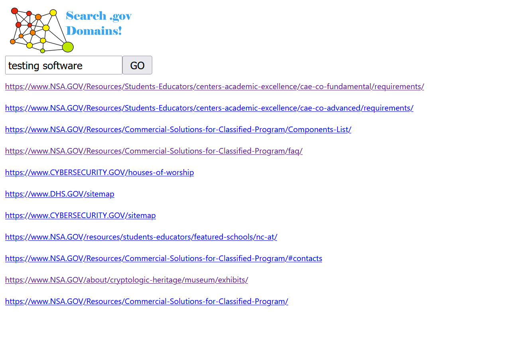

# Mini Search Engine
This projects creates a mini search engine that can be used to serach selected .gov domains.
## Technology used:
This project has both the backend and the frontend. The backed has the core of the search engine and it is written in Java. The server uses Spark framework to accept requests and send back responses. Backend is structured with Gradle framework. 

The frontend is written in Typescript and HTML/CSS using the React library. 

## How it works:

Three main aspects of a search engine are the web crawler, the indexer, and the search engine itself. 

Web crawler scrapes all the information it can find for the given URL. Indexer parses that data into meaningful data structures, so that it is organized and can be queried. Search algorithm uses indexer data to return best results for user queries.

Below each component is described in greater detail. 

### Web Crawler:
Web crawler uses **Jsoup** library (https://jsoup.org/) to scrape HTML files and extract plain text from them. This library is also used to extract all other links on the page.

My web crawler goes to the depth of 1. The depth defines how many URLs the crawler will follow on the specific page before stopping.  For depth 1 this means if you give my crawler a URL it will scrape that URL for plain text and other URLs. Then, those other URLs will be scraped as well but this time, just for the plain text since we are already at depth 1.

My crawler returns every URL mapped to the plain text associated with it. 

### Indexer:
My indexer uses the following data structures to store the scraped date: 
First it stores every word mapped to the list of URLs that contain that word. So, if we had 3 pages page1.com, page2.com and page3.com that had these words in them respectively {Hello Alex}, {Hi Alex}, {Hey!} we would have this outcome in the indexer:

    hello -> {page1.com}
    hi -> {page2.com}
    alex -> {page1.com, page2.com}
    hey -> {page3.com}

Note that all the plain text is **converted to lower case**. Also, all of the punctuation is removed (see StringCleaner for details). 

Second we store the URL mapped to the word and its frequency in that URL. For example, if page1.come has word “the” appear 3 times, word “Alex” appear 1 time, and word “great” appear 5 times the data will look like this:

    page1.com -> {the -> 3, alex -> 1, great -> 5}

Finally, we store all of plain text from the page as a string. 

All of this data is stored in the IndexData object and is used by the SearchEngine.

### Search Engine:
Search Engine takes the query from the server and returns results (list of URLs) to the server.

Search engine uses the **ranking function** to determine which URL is a better search result. It looks at the total number of times a word from the user query appears in a given URL and adds those together into a score. Next search engine looks if the URL contains the whole query and if it does some amount of bonus score is added. Bonus score can be adjusted. URLs are than sorted by their scores and are returned back to the server.

### Server:
The server has just one path that accepts search queries. It calls the search engine and receives back search results which are than sent back to the client in Json format. 

The server is also responsible for **reindexing**. Every x amount of time the server calls the indexer in the **separate thread** to reindex the URLs. While this is happening, the server can still accept client requests, and return search results based on the old indexing data. At the end of reindexing when the data is ready, we need to assign in to IndexData, and to avoid concurrency issues, IndexData is temporarily unavailable, so client requests will not get results. However, if the client requests again everything will work as normal. 

### Client:
The client is written using React. It requests date from the server and waits for the response. Once it gets the response, it parses the Json data and displays URLs to the client like so:

If something goes wrong with the request, or the server, client is notified trough alert messages. 

### How to Run:
Clone the repository.

To run the backend run Server.java from IDE (Requires Java Development Kit (JDK)), it will start Indexing URLs immediately.

In order to change what URLs to index, change domains.txt file. The format is one URL per line (no spaces, no empty lines. (Note: indexing will break if the certificate chain of the URL cannot be verified). 

In order to change the time interval for reindexing change REINDEX_TIMER in Server.java (The value is in milliseconds). 
To run the frontend run “npm run start” in command line from “~Mini_Search_Engine\frontend\search_engine_ui” directory. The fronted could be used in any browser at localhost:3000.
